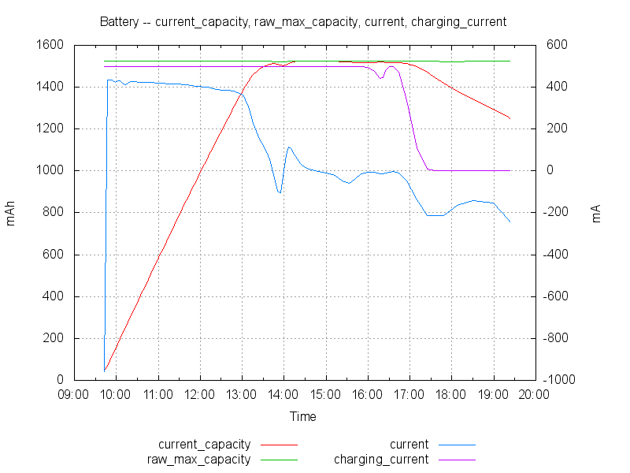

# Get GOOD energy diagnostics for your iDevice

There's a lot of misinformation about power usage of iDevices out there, but a
dearth of actual information and diagnostics tools.

The folks at the Apple Genius Bar seem have very good insight into your device,
but unfortunately, the tools they use there are not publicly available.

Until now...

## What's this repository?

This toolset is based on [Christopher Anderson's excellent
work](http://www.lyonanderson.org/blog/2014/02/06/ios-power-diagnostics/) on
emulating a Genius Bar WiFi network and getting your phone to upload its
diagnostics information to your computer. He wrote a mitmproxy script that I've
shamelessly reproduced here so you don't have to go hunting for it, but all the
original work is his.

I'm adding tools to make sense of the bigass raw data dump that you're getting
from your phone. Graphs work a lot better for human consumpation than big text
files :).

The end result is something like this (and a bunch more graphs):

## Notes

Currently, this script has only been tested on iOS 7. It seems that iOS 8 may
have a different format for the powerlog. Pull requests are welcome.

## Prerequisites

* [Python](http://www.python.org)
* [mitmproxy](http://mitmproxy.org)
* [gnuplot](http://www.gnuplot.info)

Warning: I've taken no effort to make this work under Windows. If you want to
go that route, good luck, let me know how it goes.

## Grabbing the data

[Original Blog Post](http://www.lyonanderson.org/blog/2014/02/06/ios-power-diagnostics/)

The steps are as follows:

* Install mitmproxy on your PC
* Edit `capture.py` and change the iPhone model number to match your actual
  device's.
* Run `mitmdump -e -s capture.py`
* Set mitmproxy as WiFi proxy on your iDevice
* Visit `http://mitm.it/` from your iDevice and install the CA
* Visit `diags://` on your iDevice, enter `123456` as ticket number and select
  Extended Diagnostics.

Done! You'll have two `.tar.gz` files in the script's working directory.
Extract them, and especially for the powerlog, extract the files in there.

## Plotting the data

Run `graph.py` on all your powerlog files:

    python graph.py PLArchive/*.powerlog | gnuplot

(Note: on Windows the above will most certainly not work and you'll need to run
the script on individual files)

`gnuplot` will create a bunch of `.png` files in the current directory.

Ta-daaah!!
